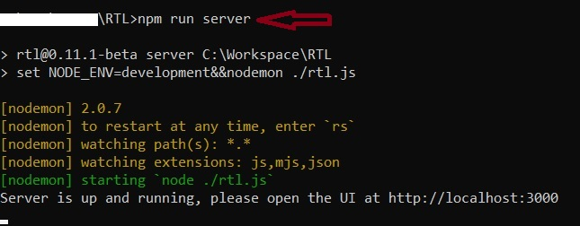
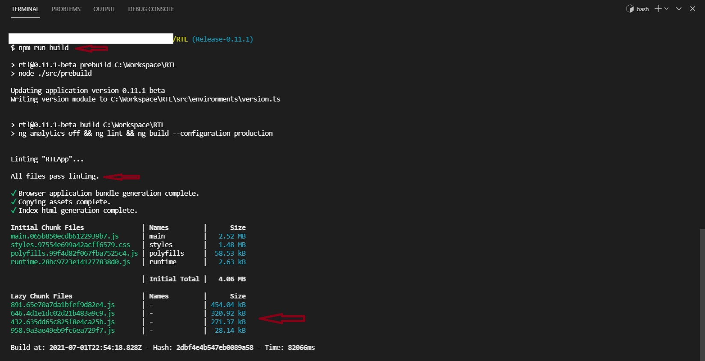

## Contributing to RTL
Thanks for your interest in contributing to the development of RTL. RTL is a community project and aspires to remain free and open source for the benefit of the community. With that objective in mind, this document provides contribution guidelines which the community can utilize to contribute towards the development and maintenance of this software.

### How Can I Contribute
There are multiple ways you can contribute towards the development and not all of those methods involve coding. Below are a few examples on how meaningful contributions can be made.
* [Bug Report](#bug) - While using RTL, if you notice something is not working correctly create a bug report, by creating an issue.
* [Feature Request](#feature) - While using RTL, if you feel that the software should be changed in certain way to make it for usable and helpful, create a feature request.
* [Testing](#testing) - Testing is one the easiest and most sought after method of contribution. Testing can be done on release branches, so that releases are relatively bug free.
* [Design](#design) - Design inputs can be made based on user enhancement suggestions or novel ideas which you get while using RTL.
* [Code](#code) - Development contributions are made via making coding changes to the software and getting it tested, reviewed and merged.
* [Code Review](#codereview) - Code review contributions are made by reviewing the code changes submitted via PRs to address bugs or feature requests

#### Bug Report
Bug reports are reports of technical or functional issues with the software. Bug reports help with the removal of defects from the software and improve its quality. Guidelines for submitting a bug report:
* Label the bug with the correct Lightning implementation (LND/C-Lightning/Eclair).
* Add the `Bug` label to the issue
* Provide details of your configuration like Device, Operating system, Bitcoin version, Lightning implementation version, RTL version etc.
* Attempt to explain the scenario in detail, so that the developer can try to replicate the issue at their end.
* If the bug is with the UI, screenshots help. Try to highlight the problem areas by circling with red outline.
* Take care to redact sensitive info from the screenshots like Pubkey or channel IDs etc.
* Be responsive to the developers requesting details on the issues.

#### Feature Request
Feature Requests are requests raised to add new features to the application. The features requests can range from technical to functional, making the application better for everyone. Guidelines to follow for create a feature request:
* Label the feature request with the correct Lightning implementation (LND/C-Lightning/Eclair).
* Add the `Enhancement Request` label to the issue
* If the feature relates to an existing aspect of the application, indicate clearly which part of the application the feature request relates to. E.g. Transactions page under Lightning menu.
* Provide the justification for the feature request. E.g. Privacy/Security/Usability benefit.
* If the feature request is technical in nature, try to provide the platform detail like OS, Lightning Implementation version etc.
* For new UI features mockups are helpful for the developers.
* Be responsive on the feature requests when developers request details or clarification and also help with the testing of the features requested.

#### Testing
Testing is the easiest and most effective method to contribute. It helps uncover bugs and improve the quality of software. Best time to test would be pre-release, when the changes are being made to the software for the next release. RTL maintains a release branch for the next planned release and changes are merge to the release branch on a regular basis. The testers can contribute by pulling from the release branch and testing the software. If issues are found during testing, follow the steps described above to raise bug reports to help address the issues.

#### Design
Design suggestions are always welcome and helpful. Design suggestion can range from improving both the aesthetics as well as the UX of the application. We believe improving design and UX of the application is an ongoing journey. User feedback and bugs raised also provide insights into how both can be improved. if you would like to provide design related suggestions or contribute with design inputs, raise issues on the [Design repo of RTL](https://github.com/Ride-The-Lightning/RTL-Design) and follow the guidance provided there.

#### Code
Contributions via code is the most sought after contribution and something we enthusiastically encourage. Follow the below guideline to be able to contribute code to RTL.

##### Pull Code
* Pull the code from the release (current eg Release-0.11.1) or [master](https://github.com/Ride-The-Lightning/RTL/tree/master) branch into your local workspace via github commandline/GUI.

##### Install Dependencies
* Assuming that nodejs (v12 & above) and npm are already installed on your local machine. Go into your RTL root folder and run `npm install`. 
* Sometimes after installation, user receives a message from npm to fix dependency vulnerability by running `npm audit fix`. Please do not follow this step as it can break some of the working RTL code on your machine. We audit and fix these vulnerabilities as soon as possible at our end.
	
##### Node Server for Development
* The RTL server code has been written in typescript and `npm run watchserver` script can be used to compile and generate their javascript equivalents. Keep the script running to watch for realtime changes and compilation. `watchserver` and `buildserver` scripts get the configuration options from tsconfig, read .ts files from the `./server` folder and save the compiled .js and .map files in `./backend` folder.
* To run RTL node server in development mode, open another command window, go to workspace/RTL and excute `npm run server`. This will run the script named `server` defined in package.json. This script sets the node environment as development and starts the server from rtl.js. Nodemon restarts the node application when file changes in the directory are detected.
* This `server` script has been written for windows machine. Please update the script to set the `NODE_ENV=development` according to your machine's OS.
* To check all available scripts for the project, explore the `scripts` section of package.json. 

##### Angular Server for Development
* The last step starts the node server but it cannot detect and update the code written in Angular. We run the angular development server separately while working on the frontend of the project and package the final build once the development is finished. 
* To run the angular development server, go to workspace/RTL and run `npm run start`. It will start the angular server at default '4200' port and serve the application on localhost:4200.

	
##### Package Angular Build
* If the change/update were only made for the backend, you can directly move to the next step.
* In case the code was updated for the frontend (in the src folder), the Angular application code needs to be compiled into the output directory named `angular` at workspace/RTL. It can be done by running `npm run build` command in the RTL root.
* Please make sure to remove all linting and other errors thrown by the build command before moving to the next step.

	
##### Create a Pull Request
* Create a new branch on the github to push your updated code.
* Commit your updates into the newly created branch.
* Create a new pull request once you are satisfied with your updates to be merged into the `release`/`master` branch with details of your updates and submit it for the review.

##### Caution about adding new libraries
* We are conservative in adding new dependencies to the repository. Do your best to not add any new libraries on RTL. We believe this is the best strategy to keep the software safe from vulnerabilites.
* Confirm before starting by creating an issue about adding the library 
* The library should be popular, well maintained and pre-existing vulnerability free.
