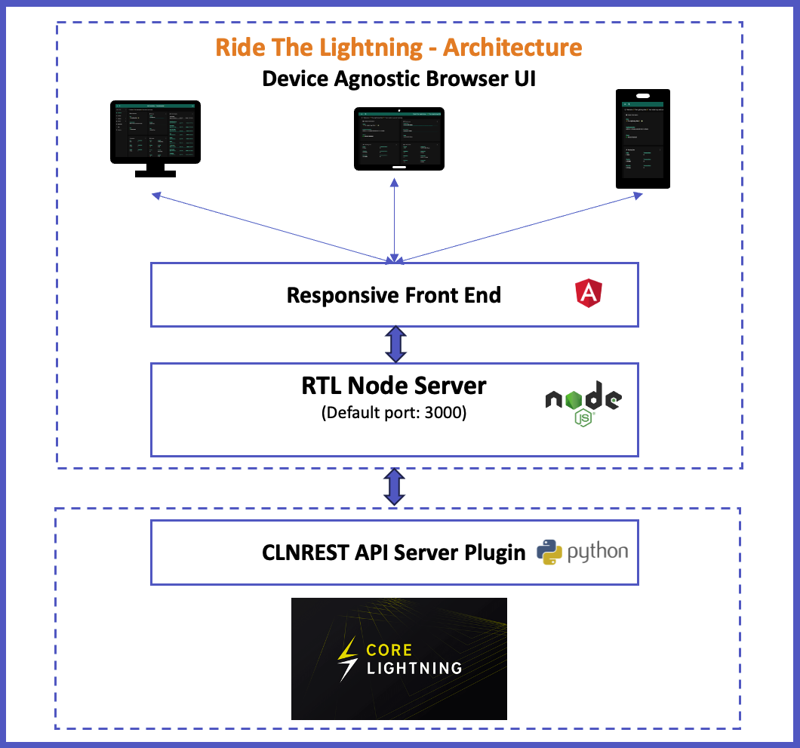
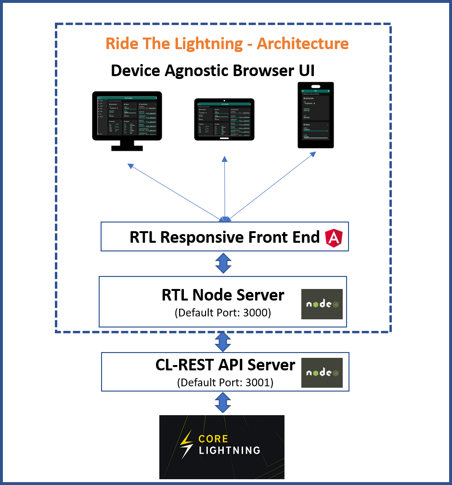

## RTL Core lightning setup

* [Introduction](#intro)
* [Pre-requisite](#prereq)
* [Architecture](#arch)
* [Installation](#install)
* [Prep for execution](#prep)
* [Start the server and access the app](#start)

### <a name="intro"></a>Introduction
RTL is now enabled to manage lightning nodes running Core Lightning

Follow the below steps to install and setup RTL to run on Core Lightning

### <a name="prereq"></a>Pre-requisites:
1. Functioning Core Lightning node. Follow install instructions on their [github](https://github.com/ElementsProject/lightning)
2. NodeJS - Can be downloaded [here](https://nodejs.org/en/download)
3. CLNRest - Ensure that core lightning's `CLNRest` API server is configured. Configuration instructions [here](https://docs.corelightning.org/docs/rest#configuration)
4. Create/reuse core-lightning's rune. Check [`createrune`](https://docs.corelightning.org/reference/lightning-createrune) and [`showrunes`](https://docs.corelightning.org/reference/lightning-showrunes) documentation for more details on how to create runes
4. Copy the `rune` and save it in a file which must be accessible to RTL. The content of the file must be `LIGHTNING_RUNE="<your-rune>"`

### <a name="arch"></a>Architecture


### <a name="install"></a>Installation:
To download a specific RTL version follow the instructions on the [release page](https://github.com/Ride-The-Lightning/RTL/releases)

To download from master (*not recommended*):

#### First time setup
```
$ git clone https://github.com/Ride-The-Lightning/RTL.git
$ cd RTL
$ npm install --omit=dev
```

#### Or: Update existing build
```
$ cd RTL
$ git reset --hard HEAD
$ git clean -f -d
$ git pull
$ npm install --omit=dev
```

#### Error on npm install
If there is an error with `upstream dependency conflict` message then replace `npm install --omit=dev` with `npm install --omit=dev --legacy-peer-deps`.

### <a name="prep"></a>Prep for Execution
RTL requires its own config file `RTL-Config.json`, to start the server and provide user authentication on the app
* Rename the file `Sample-RTL-Config.json` to `RTL-Config.json` located at`./RTL`
* Locate the complete path of the readable `.commando` file on your node
* Modify the RTL conf file per the example file below

Ensure that the follow values are correct per your config:
* `lnImplementation` - This should be `CLN`, indicating that RTL is connecting to a core lightning node
* `runePath` - Path of the folder including **filename** which contains the `rune` for the node. The content of the file must be `LIGHTNING_RUNE="<your-rune>"`
* `lnServerUrl` - complete url with ip address and port of the CLNRest server
* `multiPass` - Specify the password (in plain text) to access RTL. This password will be hashed and not stored as plain text
* `configPath` (optional) - File path of the core lightning config file, if RTL server is local to the core lightning server

```
{
  "multiPass": <password required for accessing RTL>,
  "port": "3000",
  "defaultNodeIndex": 1,
  "dbDirectoryPath": "<Complete path of the folder where rtl's database file should be saved>",
  "SSO": {
    "rtlSSO": 0,
    "rtlCookiePath": "",
    "logoutRedirectLink": ""
  },
  "nodes": [
    {
      "index": 1,
      "lnNode": "Core Lightning Testnet # 1",
      "lnImplementation": "CLN",
      "authentication": {
        "runePath": "<Modify to include the path of the folder including filename which contains `rune`>",
        "configPath": "<Optional - Config file path for core lightning>"
      },
      "settings": {
        "userPersona": "OPERATOR",
        "themeMode": "DAY",
        "themeColor": "PURPLE",
        "bitcoindConfigPath": "",
        "logLevel": "INFO",
        "fiatConversion": false,
        "unannouncedChannels": false,
        "lnServerUrl": "https://<CLNRest api server ip address>:3001"
      }
    }
  ]
}
```
### <a name="start"></a>Start the server and access the app
Run the following command:

`$ node rtl`

If the server started successfully, you should get the below output on the console:

`$ Server is up and running, please open the UI at http://localhost:3000 or your proxy configured url`

Open your browser at the following address: http://localhost:3000 to access the RTL app

### Detailed config and instructions
For detailed config and access options and other information, view the main readme page
