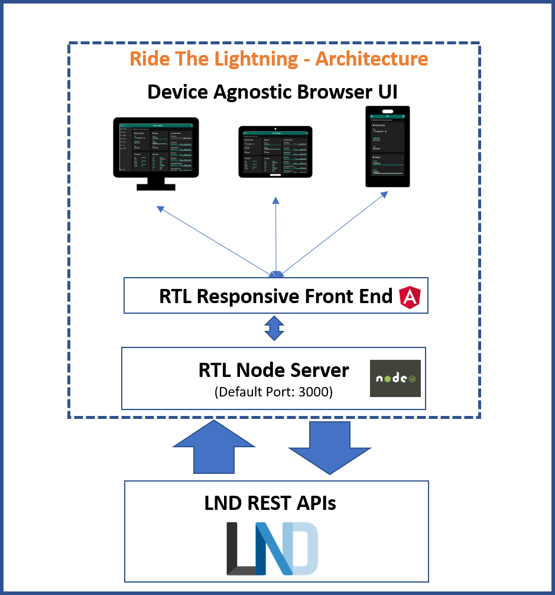

## Ride The Lightning (RTL)


<a href="https://snyk.io/test/github/Ride-The-Lightning/RTL"></a>
[](https://github.com/DAVFoundation/captain-n3m0/blob/master/LICENSE)

**Intro** -- [Application Features](docs/Application_features.md) -- [Road Map](docs/Roadmap.md) -- [Application Configurations](docs/Application_configurations) -- [C-Lightning](docs/C-Lightning-setup.md) -- [Eclair](docs/Eclair-setup.md) -- [Contribution](docs/Contributing.md)

* [Introduction](#intro)
* [Architecture](#arch)
* [Prerequisites](#prereq)
* [Installation](#install)
* [Prep For Execution](#prep)
* [Start The Server](#start)
* [Access The Application](#access)
* [Troubleshooting](#trouble)

### <a name="intro"></a>Introduction
RTL is a full function, device agnostic, web user interface to help manage lightning node operations.
RTL is available on [LND](https://github.com/lightningnetwork/lnd), [C-Lightning](https://github.com/ElementsProject/lightning) and [Eclair](https://github.com/ACINQ/eclair) implementations.

* C-Lightning users, refer to [this](docs/C-Lightning-setup.md) page for install instructions.
* Eclair users, refer to [this](docs/Eclair-setup.md) page for install instructions.
* LND users, follow the instructions below

Lightning Network Daemon(LND) is an implementation of Lightning Network BOLT protocol by [Lightning Labs](https://lightning.engineering/).

Pre-requisite for running RTL is a functioning and synced LND node. If you are a Raspberry Pi or a Linux user, you can follow the famous Stadicus's [guide](https://stadicus.github.io/RaspiBolt/) to setup a Bitcoin + Lighting node.

RTL is available on the below platforms/services:
* [RaspiBlitz](https://github.com/rootzoll/raspiblitz)
* [Nodl](https://www.nodl.it/)
* [BTCPayserver](https://github.com/btcpayserver/btcpayserver-docker)
* [Blockdaemon](https://blockdaemon.com/bitcoin-lightning-protocol-details)
* [myNode](http://mynodebtc.com)
* [Lux Node](https://luxnode.io/product/lux-node/)
* [BCubium](https://bgeometrics.com)
* [Start9Labs](https://start9labs.com)
* [Umbrel](https://github.com/getumbrel/umbrel)

Docker Image: https://hub.docker.com/r/shahanafarooqui/rtl

### <a name="arch"></a>Architecture


### <a name="prereq"></a>Prerequisites
* Functioning and synced LND lightning node.
* Node.js, which can be downloaded [here](https://nodejs.org/en/download/)
* Recommended Browsers: Chrome, Firefox, MS Edge

### <a name="install"></a>Installation
To download a specific RTL version follow the instructions on the [release page](https://github.com/Ride-The-Lightning/RTL/releases)

To download from master (*not recommended*):
#### First time setup
```
$ git clone https://github.com/Ride-The-Lightning/RTL.git
$ cd RTL
$ npm install --only=prod
```
#### Or: Update existing dependencies
```
$ cd RTL
$ git reset --hard HEAD
$ git clean -f -d
$ git pull
$ npm install --only=prod
```
### <a name="prep"></a>Prep for Execution
RTL requires its own config file `RTL-Config.json`, to start the server and provide user authentication on the app.

*Advanced users can refer to [this page](docs/Multi-Node-setup.md), for config settings required to manage multiple nodes*

* Rename `sample-RTL-Config.json` file to `RTL-Config.json`.
* Locate the complete path of the readable macroon file (admin.macroon) on your node and the lnd.conf file.
* Modify the `RTL-Config.json` file per the example file below

Example RTL-Config.json:
```
{
  "multiPass": "password",
  "port": "3000",
  "defaultNodeIndex": 1,
  "SSO": {
    "rtlSSO": 0,
    "rtlCookiePath": "",
    "logoutRedirectLink": ""
  },
  "nodes": [
    {
      "index": 1,
      "lnNode": "LND Testnet",
      "lnImplementation": "LND",
      "Authentication": {
        "macaroonPath": "<Complete path of the folder containing LND's admin.macaroon for the node # 1>",
        "swapMacaroonPath": "<Complete path of the folder containing Loop's loop.macaroon for the node>",
        "boltzMacaroonPath": "<Complete path of the folder containing Boltz admin.macaroon for the node>",
        "configPath": "<Optional:Path of the .conf if present locally or empty>",
        "lnApiPassword": "<Optional:Can be used to provide password in ECL implementation>"
      },
      "Settings": {
        "userPersona": "OPERATOR",
        "themeMode": "DAY",
        "themeColor": "PURPLE",
        "channelBackupPath": "C:\\RTL\\backup\\node-1",
        "bitcoindConfigPath": "<Optional: path of bitcoind.conf path if available locally>",
        "enableLogging": true,
        "fiatConversion": false,
        "lnServerUrl": "<url for LND REST APIs for node #1 e.g. https://192.168.0.1:8080>",
        "swapServerUrl": "<url for swap server REST APIs for the node. e.g. https://localhost:8081>",
        "boltzServerUrl": "<url for boltz server REST APIs for the node. e.g. https://localhost:9003>"
      }
    }
  ]
}
```
For details on all the configuration options refer to [this page](./docs/Application_configurations).

#### User Authentication on RTL
RTL requires the user to be authenticated by the application first, before allowing access to LND functions.
Specific password must be provided in RTL-Config.json (in plain text) for authentication. Password should be set with `multiPass:<user defined>` in the `Authentication` section of RTL-Config.json. Default initial password is `password`.

### <a name="start"></a>Start the Server
Run the following command:

`$ node rtl` 

If the server started successfully, you should get the below output on the console:

`$ Server is up and running, please open the UI at http://localhost:3000`

#### Optional: Running RTL as a service (Rpi or Linux platform users)
In case you are running a headless Rpi or a Linux node, you can configure RTL as a service.

* Create RTL systemd unit and with the following content. Save and exit.
```bash
# Raspibolt RTL: systemd unit for RTL
# /etc/systemd/system/RTL.service

[Unit]
Description=RTL daemon
Wants=lnd.service
After=lnd.service

[Service]
ExecStart=/usr/bin/node <Full path of the RTL folder>/rtl
User=<user>
Restart=always
TimeoutSec=120
RestartSec=30

[Install]
WantedBy=multi-user.target
```

* enable and start RTL
```
$ sudo systemctl enable RTL
$ sudo systemctl start RTL
```
* montior the RTL log file in realtime(exit with Ctrl-C)

`$ sudo journalctl -f -u RTL`

### <a name="access"></a>Accessing the Application
You can access the application in multiple setups (Please make note of the 4th exception):
1. Same device as the server:
Open your browser at the following address: http://localhost:3000 to access the RTL application.

2. Remotely from another device on the same local network (home network) as the node(RTL server+LND running on the same device):
* Ensure that the if a firewall running on your node, it allows access on port 3000 (or the custom port configured for RTL).
* Determine the IP address of your node to access the application.
E.g. if the IP address of your node is 192.168.0.15 then open your browser at the following address: http://192.168.0.15:3000 to access RTL.

3. Config tweaks for running RTL server and LND on separate devices on the same network can be found [here](docs/RTL_setups.md).

4. Any Other setup: **Please be advised, if you are accessing your node remotely via RTL, its critical to encrypt the communication via use of https. You can use solutions like nginx and letsencrypt or TOR to setup secure access for RTL.** 
- Sample SSL setup guide can be found [here](docs/RTL_SSL_setup.md)
- (For advanced users) A sample SSL guide to serve remote access over an encrypted Tor connection can be found [here](docs/RTL_TOR_setup.md)

### <a name="trouble"></a>Troubleshooting
In case you are running into issues with the application or if you have feedback, feel free to open issues on our github repo.
You can also reach out to us via twitter DM on [@Suheb__](https://twitter.com/Suheb__) or [@RTL_App](https://twitter.com/RTL_App). Thanks for your interest.
