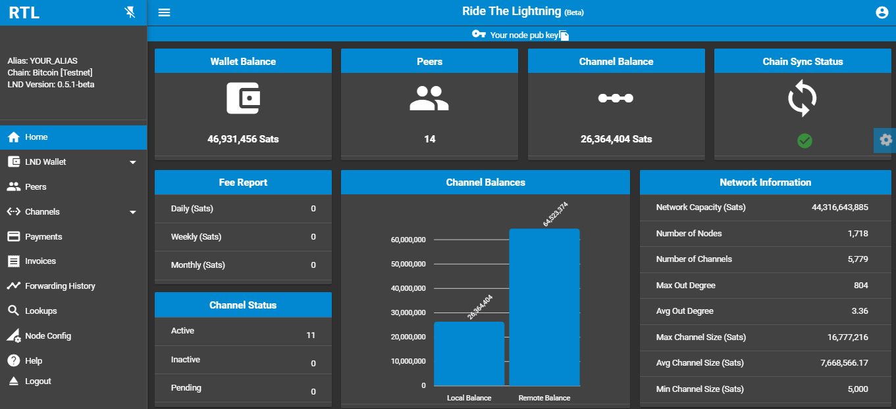
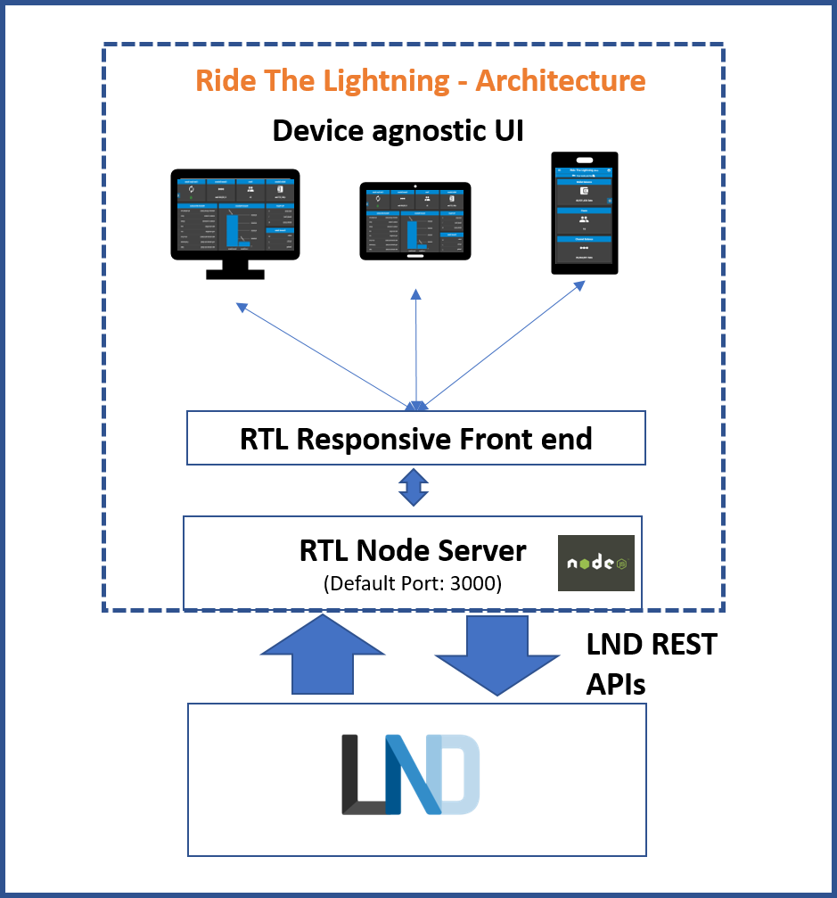

## Ride The Lightning (RTL)


<a href="https://snyk.io/test/github/ShahanaFarooqui/RTL"></a>
[](https://github.com/DAVFoundation/captain-n3m0/blob/master/LICENSE)
### Stable Release: v0.2.1

**Intro** -- [Application Features](Application_features.md) -- [Road Map](Roadmap.md) -- [LND API Coverage](LNDAPICoverage.md) -- [Application Configurations](Application_configurations)

* [Introduction](#intro)
* [Architecture](#arch)
* [Prerequisites](#prereq)
* [Installation](#install)
* [Prep For Execution](#prep)
* [Start The Server](#start)
* [Access The Application](#access)
* [Troubleshooting](#trouble)

### <a name="intro"></a>Introduction
RTL is a full function, device agnostic web user interface for Lightning Network Daemon, to help manage lightning node operations.
Lightning Network Daemon is an implementation of Lightning Network BOLT protocol by [Lightning Labs](https://lightning.engineering/).

Pre-requisite for running RTL is a functioning LND node. You can setup your own node, by following the below guides:
* Windows/Mac users can explore Pierre Rochard's [Node Launcher](https://github.com/lightning-power-users/node-launcher)
* Linux or Raspberry Pi users can explore Stadicus's [guide](https://github.com/Stadicus/guides/blob/master/raspibolt/README.md)

RTL source code is available at this [repo](https://github.com/ShahanaFarooqui/RTLFullApplication)

For detailed screenshots and UI operation guide you can visit our [medium post](https://medium.com/@suheb.khan/how-to-ride-the-lightning-447af999dcd2)

### <a name="arch"></a>Architecture


### <a name="prereq"></a>Prerequisites
Please ensure that you have completed the installation of LND lightning node.

The application also requires Node.js, which can be downloaded [here](https://nodejs.org/en/download/)

Recommended Browsers: Chrome, Firefox, MS Edge

### <a name="install"></a>Installation
#### First time setup
Fetch sources from the RTL git repository, by executing the below command at the command prompt:

`$ git clone https://github.com/ShahanaFarooqui/RTL.git`

Move to the newly created directory:

`$ cd RTL`

Fetch the dependencies and build the application by running:

`$ npm install`

#### Updating existing build
```
$ cd RTL
$ git reset --hard HEAD
$ git clean -f -d
$ git pull
$ npm install
```
### <a name="prep"></a>Prep for Execution
Rename `sample-RTL.conf` file to `RTL.conf`.
RTL requires its config file `RTL.conf`, to start the server and provide user authentication on the app.
Locate the complete path of the readable macroon file (admin.macroon) on your node and lnd.conf file
The path of the macroon directory and lnd.conf needs to be provided in the RTL.conf file to start the server.

For details on all the configuration options refer to [this page](https://github.com/ShahanaFarooqui/RTL/blob/master/Application_configurations).

Sample RTL.conf:
```
[Authentication]
macaroonPath=C:\Users\<user>\AppData\Local\Lnd\data\chain\bitcoin\testnet
nodeAuthType=CUSTOM
lndConfigPath=C:\Users\<user>\AppData\Local\Lnd\lnd.conf
rtlPass=***

[SSO]
rtlSSO=0
rtlCookiePath=C:\RTL\cookies\auth.cookie
logoutRedirectLink=/login

[Settings]
flgSidenavOpened=true
flgSidenavPinned=true
menu=Vertical
menuType=Regular
theme=dark-blue
satsToBTC=false
lndServerUrl=https://192.168.0.0:8080/v1
bitcoindConfigPath=
enableLogging=false
port=3000
reverseProxy=0
```
#### User Authentication on RTL
Basic user authentication has now been added on RTL. This requires user to be authenticated by RTL first, before accessing LND functions.
There are two options to configure authentication on RTL, depending on the `nodeAuthtype` value provided in RTL.conf.

For `nodeAuthType=DEFAULT`
Password provided in lnd.conf for the rpc setting for bitcoind will be used for authentication.

For `nodeAuthType=CUSTOM`
Specific password can be provided in RTL.conf (in plain text), to be used by RTL for authentication.
Password should be set with `rtlPass=<user defined>` in the [Authentication] section of RTL.conf

### <a name="start"></a>Start the Server
Run the following command:

`node rtl` 

If the server started successfully, you should get the below output on the console:

`Server is up and running, please open the UI at http://localhost:3000`

#### Optional: Running RTL as a service (rpi or Linux platform users)
In case you are running a headless rpi or Linux node, you can configure RTL as a service.

* Create RTL systemd unit and with the following content. Save and exit.
```bash
# Raspibolt RTL: systemd unit for RTL
# /etc/systemd/system/RTL.service

[Unit]
Description=RTL daemon
Wants=lnd.service
After=lnd.service

[Service]
ExecStart=/usr/bin/node /home/admin/Projects/RTL/rtl
User=<user>
Restart=always
TimeoutSec=120
RestartSec=30

[Install]
WantedBy=multi-user.target
```

* enable and start RTL
```
$ sudo systemctl enable RTL
$ sudo systemctl start RTL
```
* montior the RTL log file in realtime(exit with Ctrl-C)

`$ sudo journalctl -f -u RTL`

### <a name="access"></a>Accessing the Application
You can access the application in two ways:
#### Same device as the server
Open your browser at the following address: http://localhost:3000 to access the RTL application.

#### Remotely from another device on the same local network as the node
Ensure that the firewall running on your node allows access on port 3000 (or the custom port configured for RTL).
Determine the IP address of your node to access the application.

E.g. if the IP address of your node is 192.168.0.15 then open your browser at the following address: http://192.168.0.15:3000 to access RTL.

### <a name="trouble"></a>Troubleshooting
Feel free to open issues on our github, in case you are running into issues with the application.

You can also reach out via twitter DM on @Sauby_k or @RTL_App. Thanks for your interest.
