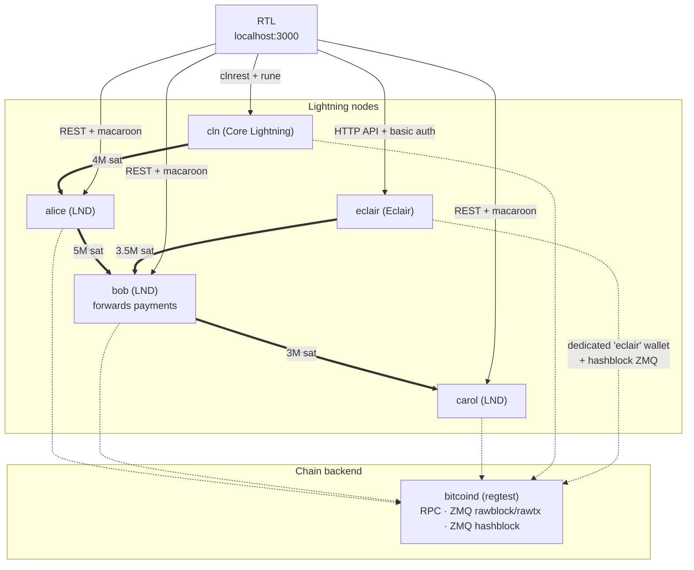
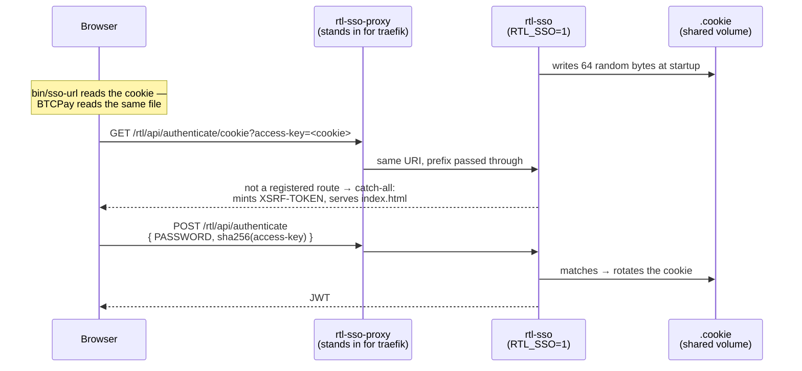

# RTL regtest dev fixture

### NOT suitable for production. Development only. Every credential here is throwaway.

A self-contained regtest network for developing and testing RTL: `bitcoind`, three
LND nodes, a Core Lightning node, an Eclair node, and RTL wired to all five.

```
alice  --[ 5,000,000 sat ]--> bob --[ 3,000,000 sat ]--> carol
cln    --[ 4,000,000 sat ]--> alice
eclair --[ 3,500,000 sat ]--> bob
```

## Topology



Thick arrows are channels (opener → peer), dotted arrows the chain backend each node
uses, and solid arrows how RTL reaches each node.

bob sits in the middle so it accrues forwarding history, which is what gives RTL's
routing screens something to show. Two nodes would leave them empty. The `cln`
(Core Lightning) node gives RTL's CLN screens a real backend — it talks to RTL over
clnrest with rune auth. The `eclair` node does the same for RTL's Eclair screens —
RTL talks to its HTTP API with basic auth.

bitcoind and Eclair images come from [Polar](https://lightningpolar.com); the Core Lightning
image is the official [`elementsproject/lightningd`](https://hub.docker.com/r/elementsproject/lightningd)
and the LND nodes use the official [`lightninglabs/lnd`](https://hub.docker.com/r/lightninglabs/lnd).
All are multi-arch (amd64 + arm64) and nothing is built locally, so this works on
Apple Silicon. (The official `acinq/eclair` image is amd64-only and its versioned tags
are years stale, which is why Polar's build of the same source is used instead.)

**The three LND nodes deliberately run two different versions**, so that version-gated UI can be
checked against a node on either side of a gate without editing the fixture:

| Node    | LND version    |
|---------|----------------|
| `alice` | `v0.21.2-beta` |
| `bob`   | `v0.20.3-beta` |
| `carol` | `v0.21.2-beta` |

`bob` is the one held back because it is the routing middle node, so every forwarded payment in
the fixture crosses a version boundary. LND comes from `lightninglabs/lnd` rather than Polar
because Polar publishes nothing newer than `0.20.0-beta`; that image's entrypoint is already
`lnd`, so the `command:` lists start at the first flag, and its datadir is `/root/.lnd` rather
than Polar's `/home/lnd/.lnd` — which is why `bin/ln-cli` and `scripts/seed.sh` pass `--lnddir`.

## Requirements

Docker with Compose v2 (`docker compose`, not `docker-compose`).

## Quick start

From this directory:

```bash
docker compose up -d          # bitcoind, alice, bob, carol, cln, eclair, rtl
./scripts/seed.sh             # fund, connect, open channels, make payments
```

To also bring up the BTCPay single-sign-on harness, add `--profile sso` — see
[BTCPay SSO harness](#btcpay-sso-harness).

Then open <http://localhost:3000> — password `rtldev`. All five nodes (alice, bob,
carol, cln, eclair) appear in the node switcher.

Tear down, discarding all state:

```bash
docker compose down -v
```

## What the seed creates

| | |
|---|---|
| On-chain | 10,000,000 sats per node (LND) + 10,000,000 sats each on cln and eclair, confirmed |
| Channels | alice→bob 5,000,000 · bob→carol 3,000,000 · eclair→bob 3,500,000 sats (1,000,000 pushed each) · cln→alice 4,000,000 sats (no push) |
| Routed payments | 5 × alice→carol via bob (10k, 25k, 50k, 75k, 100k sats) |
| Direct payments | 2 × alice→bob (5k, 15k sats) · 2 × eclair→bob (8k, 18k sats) |
| Open invoices | 2 unpaid on carol (20k, 40k sats) · 1 unpaid on eclair (30k sats) |
| Personas | alice + bob + cln + eclair OPERATOR, carol MERCHANT |

## Determinism

Every amount and payment in `scripts/seed.sh` is fixed. A fresh run always produces
identical state, so screenshots taken before and after a change differ only by the
change. **Do not introduce randomness.**

The seed is deterministic but deliberately *not* idempotent — running it twice would
fund every node again and open a second set of channels. It refuses to run against an
already-seeded network. To start over:

```bash
docker compose down -v && docker compose up -d && ./scripts/seed.sh
```

## Helpers

```bash
bin/b-cli getblockcount                    # bitcoin-cli
bin/b-cli -rpcwallet=rtldev getbalance
bin/ln-cli alice getinfo                   # lncli, node name required
bin/ln-cli bob listchannels
bin/ln-cli bob fwdinghistory               # forwarding history
bin/e-cli getinfo                          # eclair-cli
bin/e-cli channels
bin/sso-url                                # BTCPay-style SSO link (needs --profile sso)
docker compose exec cln lightning-cli --network=regtest listpeerchannels   # Core Lightning
```

Logs:

```bash
docker compose logs -f rtl
docker compose logs alice
```

## BTCPay SSO harness

BTCPay Server bundles RTL and runs it in single-sign-on mode, reached through a very
different entry path than the standalone login: no password, a rotating cookie, and a
reverse proxy in front. That path has broken before without the standalone flow
noticing, so the fixture can reproduce it.

It is behind a compose profile, so a plain `docker compose up -d` does not start it:

```bash
docker compose --profile sso up -d
./scripts/verify-sso.sh          # 11 assertions over the whole entry path
open "$(bin/sso-url)"            # or click through it yourself
```

`bin/sso-url` prints the link BTCPay renders on its Services page. Following it lands
you in RTL already authenticated, against the `alice` node.

### How the flow works



The three services are `rtl-sso-config-init` (stages `rtl/RTL-Config.sso.json`, same
copy-into-a-volume dance as the standalone RTL), `rtl-sso` (RTL with `RTL_SSO=1`,
`RTL_COOKIE_PATH` and `LOGOUT_REDIRECT_LINK` — the env block is lifted verbatim from
BTCPay's own compose fragment), and `rtl-sso-proxy` (nginx standing in for BTCPay's
traefik). `RTL_IMAGE` overrides both RTL containers at once, so a branch build gets
tested through both entry paths.

It is a second RTL container rather than a flag on the first because RTL picks one
authentication mode at startup — SSO and the password login cannot coexist in one
instance. Both are up at the same time on different ports.

### Things this makes visible

**No prefix stripping anywhere.** RTL is built with `<base href="/rtl/">` and mounts
every route under `baseHref '/rtl'`, so BTCPay's traefik — and the nginx here — pass
`/rtl/…` through unmodified. The proxy deliberately 404s everything outside `/rtl`, so
a request escaping the prefix shows up as a failure instead of being quietly served.

**The entry URL is not a real route.** `/rtl/api/authenticate/cookie` matches nothing in
`server/routes/shared/authenticate.ts`; it falls through to the catch-all in
`server/utils/app.ts`, which is what mints the `XSRF-TOKEN` cookie and serves the SPA.
The access-key is the raw cookie file content — the frontend sha256s it before posting
and the backend compares against `sha256(cookieValue)`.

**`GET /rtl/` mints no CSRF token.** That path is served by `express.static`, which
sits *above* the catch-all, so a client entering there has no `XSRF-TOKEN` and its first
POST gets a 403. Only the catch-all mints one. This is long-standing behaviour, not a
regression — but it is why `verify-sso.sh` always seeds its cookie jar from the entry
URL, and worth remembering before concluding that CSRF is broken.

**The cookie is effectively single-use.** Authenticating rotates it, so a stale
`bin/sso-url` link fails. BTCPay re-reads the file on every page render, which is why
this is invisible in normal use.

### What it does not cover

BTCPay itself is not here — no postgres, nbxplorer or btcpayserver container. So this
does not exercise BTCPay *generating* the link, its Services page, or its own upgrades.
For that, run BTCPay's own regtest stack and point it at a local image:

```bash
# in a btcpayserver-docker checkout, after building an RTL image locally
docker build -t shahanafarooqui/rtl:dev /path/to/RTL
# then edit the rtl image tag in the generated docker-compose, or set it in
# docker-compose-generator/docker-fragments/bitcoin-lnd.yml before generating
```

That tests the real composition rather than this reconstruction of it; the harness here
is the fast everyday check.

## Notes and gotchas

**RTL's config.** `rtl/RTL-Config.regtest.json` is the tracked template. RTL rewrites
its config on startup, so an init container copies it into a volume rather than
bind-mounting it — a read-only mount makes RTL exit with `EROFS`, and a writable one
would let RTL modify a version-controlled file. The name is not `RTL-Config.json`
because `.gitignore` matches that bare filename at any depth.

**`lncli` needs `--lnddir=/home/lnd/.lnd`.** `docker compose exec` lands as root,
whose HOME is `/root`, but lnd's datadir is `/home/lnd/.lnd`. `bin/ln-cli` handles this.

**Changing bitcoind credentials.** `docker-compose.yml` carries an `-rpcauth` hash for
the `BITCOIN_RPC_USER` / `BITCOIN_RPC_PASSWORD` in `.env`. Changing them there is not
enough; regenerate the hash:

```bash
python3 - <<'EOF'
import hmac, hashlib
user, password, salt = "rtldev", "rtldev", "8a1f2c3d4e5b6a7c8d9e0f1a2b3c4d5e"
print(f"{user}:{salt}${hmac.new(salt.encode(), password.encode(), hashlib.sha256).hexdigest()}")
EOF
```

In `docker-compose.yml` the `$` must be written `$$` to escape Compose interpolation.

**Payments right after channel open will fail.** The channel graph has to reach alice
before she can route to carol. The seed waits for this; anything you script yourself
should too.

**Core Lightning auth uses a rune.** RTL talks to `cln` over clnrest and authenticates
with a rune, not a macaroon. `cln/create-rune.sh` — run from the `cln` healthcheck —
creates a master rune once the RPC is up and writes it as `LIGHTNING_RUNE="…"` to
`rtl.rune` in the shared `cln_data` volume; RTL reads it via the `runePath` in its config.
The healthcheck reports unhealthy until that file exists, so RTL (which waits on
`service_healthy`) starts only once the rune is ready. Because it runs on every
healthcheck tick (idempotent), a transient RPC-startup race just retries and self-heals
rather than wedging the stack. `--clnrest-host=0.0.0.0` is required for RTL (another
container) to reach clnrest; the default `127.0.0.1` would only be reachable from inside
the node.

**Eclair has no wallet of its own.** It drives a bitcoind wallet over RPC. The
`eclair-wallet-init` service creates a dedicated `eclair` wallet before the node starts;
without it eclair would attach to "the default loaded wallet" — the `rtldev` mining
wallet — and report the miner's balance as its own. RTL authenticates to eclair with
`lnApiPassword` (HTTP basic auth), no file mount needed. Eclair also confirms channels
at 8 blocks (`channel.min-depth-blocks`), not 6 — the seed mines accordingly. And its
`bitcoind.zmqblock` must point at a `zmqpubhashblock` endpoint — wired to the rawblock
one LND uses, eclair never sees new blocks and channels never confirm.

## Not included

The Boltz swap service.

BTCPay Server itself (postgres + nbxplorer + btcpayserver). The `sso` profile
reproduces the entry path BTCPay uses to reach RTL without running BTCPay — see
[BTCPay SSO harness](#btcpay-sso-harness) for what that covers and what it does not.
