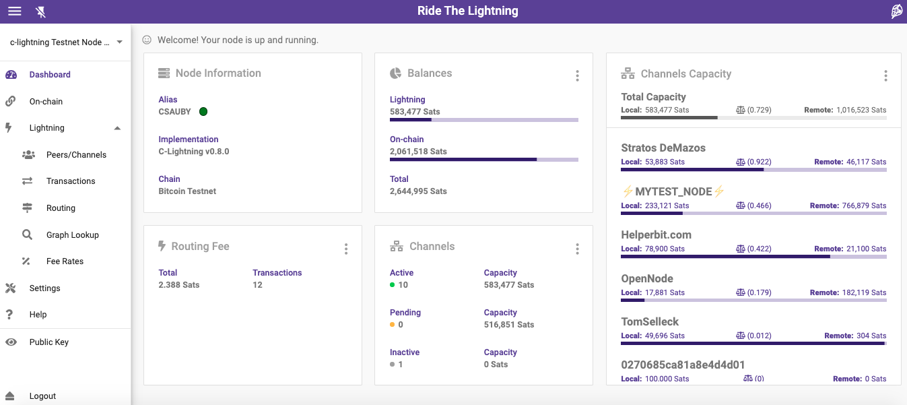
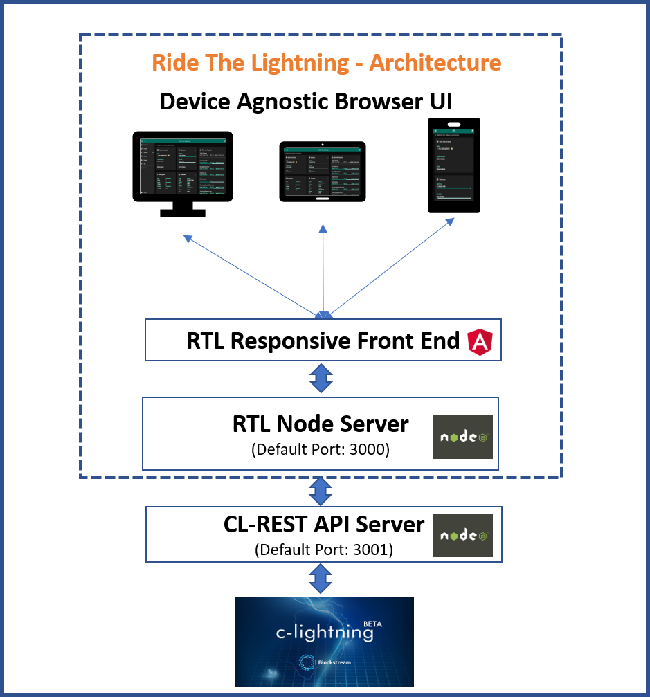

## RTL C-lightning setup

* [Introduction](#intro)
* [Pre-requisite](#prereq)
* [Architecture](#arch)
* [Installation](#install)
* [Prep for execution](#prep)
* [Start the server and access the app](#start)

### <a name="intro"></a>Introduction
RTL is now enabled to manage lightning nodes running C-Lightning.

Follow the below steps to install and setup RTL to run on C-Lightning.

### <a name="prereq"></a>Pre-requisites:
1. Functioning C-Lightning node. Follow install instructions on their [github](https://github.com/ElementsProject/lightning)
2. NodeJS - Can be downloaded [here](https://nodejs.org/en/download)
3. Cl-REST - Ensure that `cl-rest` API server is installed and running. Install instructions [here](https://github.com/Ride-The-Lightning/c-lightning-REST)
4. Copy the `access.macaroon` file from `cl-rest` to the device, on which RTL will be installed

### <a name="arch"></a>Architecture


### <a name="install"></a>Installation:
To download a specific RTL version follow the instructions on the [release page](https://github.com/Ride-The-Lightning/RTL/releases)

To download from master (*not recommended*):

#### First time setup
```
$ git clone https://github.com/Ride-The-Lightning/RTL.git
$ cd RTL
$ npm install --only=prod
```

#### Or: Update existing build
```
$ cd RTL
$ git reset --hard HEAD
$ git clean -f -d
$ git pull
$ npm install --only=prod
```
### <a name="prep"></a>Prep for Execution
RTL requires its own config file `RTL-Config.json`, to start the server and provide user authentication on the app. 
* Rename `sample-RTL-Config.json` file to `RTL-Config.json`.
* Locate the complete path of the readable `access.macaroon` from `cl-rest` on your node.
* Modify the RTL conf file per the example file below

Ensure that the follow values are correct per your config:
* `lnImplementation` - This should be `CLT`, indicating that RTL is connecting to a c-lightning node.
* `macaroonPath` - Path of the folder containing `access.macaroon` file from cl-rest server.
* `lnServerUrl` - complete url with ip address and port of the cl-rest server.
* `multiPass` - Specify the password (in plain text) to access RTL. This password will be hashed and not stored as plain text.
* `configPath` (optional) - File path of the c-lightning config file, if RTL server is local to the c-lightning server.

```
{
  "port": "3000",
  "SSO": {
    "rtlSSO": 0,
    "rtlCookiePath": "",
    "logoutRedirectLink": ""
  },
  "nodes": [
    {
      "index": 1,
      "lnNode": "c-lightning Testnet # 1",
      "lnImplementation": "CLT",
      "Authentication": {
        "macaroonPath": "<Modify to include the path of the folder with access.macaroon>",
        "configPath": "<Optional - Config file path for c-lightning>"
      },
      "Settings": {
        "userPersona": "OPERATOR",
        "themeMode": "DAY",
        "themeColor": "PURPLE",
        "bitcoindConfigPath": "",
        "enableLogging": true,
        "fiatConversion": false,
        "lnServerUrl": "https://<cl-rest api server ip address>:3001"
      }
    }
  ],
  "multiPass": <password required for accessing RTL>
}
```
### <a name="start"></a>Start the server and access the app
Run the following command:

`$ node rtl`

If the server started successfully, you should get the below output on the console:

`$ Server is up and running, please open the UI at http://localhost:3000`

Open your browser at the following address: http://localhost:3000 to access the RTL app.

### Detailed config and instructions
For detailed config and access options and other information, view the main readme page.
