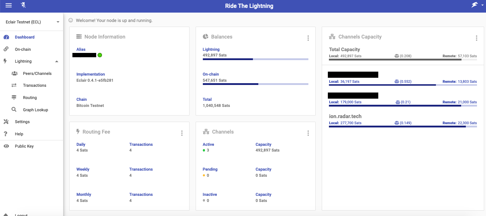

## RTL Eclair setup

* [Introduction](#intro)
* [Pre-requisite](#prereq)
* [Architecture](#arch)
* [Installation](#install)
* [Prep for execution](#prep)
* [Start the server and access the app](#start)

### <a name="intro"></a>Introduction
RTL is now enabled to manage an Eclair node.

Follow the below steps to install and setup RTL to run on Eclair.

### <a name="prereq"></a>Pre-requisites:
1. Functioning Eclair node v0.4.1 or above. Follow install instructions on their [github](https://github.com/ACINQ/eclair) page.
2. Bitcoin core v0.19.1 or above (this is an Eclair dependency).
3. NodeJS - Can be downloaded [here](https://nodejs.org/en/download)

### <a name="install"></a>Installation:
Eclair is integrated with RTL v0.8.0 and above.
To download a specific RTL version follow the instructions on the [release page](https://github.com/Ride-The-Lightning/RTL/releases)

To download from master (*not recommended*) follow the below instructions:
#### First time setup
```
$ git clone https://github.com/Ride-The-Lightning/RTL.git
$ cd RTL
$ npm install --only=prod
```
#### Or: Update existing build
```
$ cd RTL
$ git reset --hard HEAD
$ git clean -f -d
$ git pull
$ npm install --only=prod
```
### <a name="prep"></a>Prep for Execution
RTL requires its own config file `RTL-Config.json`, to start the server and provide user authentication on the app. 
* Rename `sample-RTL-Config.json` file to `RTL-Config.json`.
* Locate the complete path of the readable `eclair.conf` for your node.
* Modify the RTL conf file per the example file below

Ensure that the follow values are correct per your config:
* `lnImplementation` - This should be `ECL`, indicating that RTL is connecting to an Eclair node.
* `lnServerUrl` - complete url with ip address and port of the eclair server.
* `multiPass` - Specify the password (in plain text) to access RTL. This password will be hashed and not stored as plain text.
* `configPath` (Optinal) - Full path of the folder containing `eclair.conf` including the file name. Can be used for the basic password authentication through `eclair.api.password`.
* `lnApiPassword` (Mandatory if configPath is missing) - The same value from eclair.conf's eclair.api.password should be provided directly here. It will be used for Eclair API authentication. 

```
{
  "port": "3000",
  "SSO": {
    "rtlSSO": 0,
    "rtlCookiePath": "",
    "logoutRedirectLink": ""
  },
  "nodes": [
    {
      "index": 1,
      "lnNode": "Eclair Testnet # 1",
      "lnImplementation": "ECL",
      "Authentication": {
        "configPath": "<Optional - Config file path, including .conf file>",
        "lnApiPassword": "<Mandatory if the configPath is missing - Password used for API authentication>",
      },
      "Settings": {
        "userPersona": "OPERATOR",
        "themeMode": "DAY",
        "themeColor": "PURPLE",
        "bitcoindConfigPath": "",
        "enableLogging": true,
        "fiatConversion": false,
        "lnServerUrl": "http://<eclair api server ip address>:port"
      }
    }
  ],
  "multiPass": "<password required for accessing RTL>"
}
```
### <a name="start"></a>Start the server and access the app
Run the following command:

`$ node rtl`

If the server started successfully, you should get the below output on the console:

`$ Server is up and running, please open the UI at http://localhost:3000`

Open your browser at the following address: http://localhost:3000 to access the RTL app.

### Detailed config and instructions
For detailed config and access options and other information, view the main readme page.
